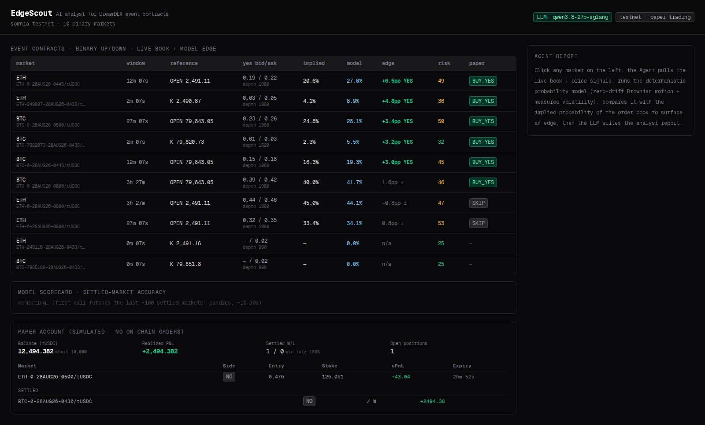
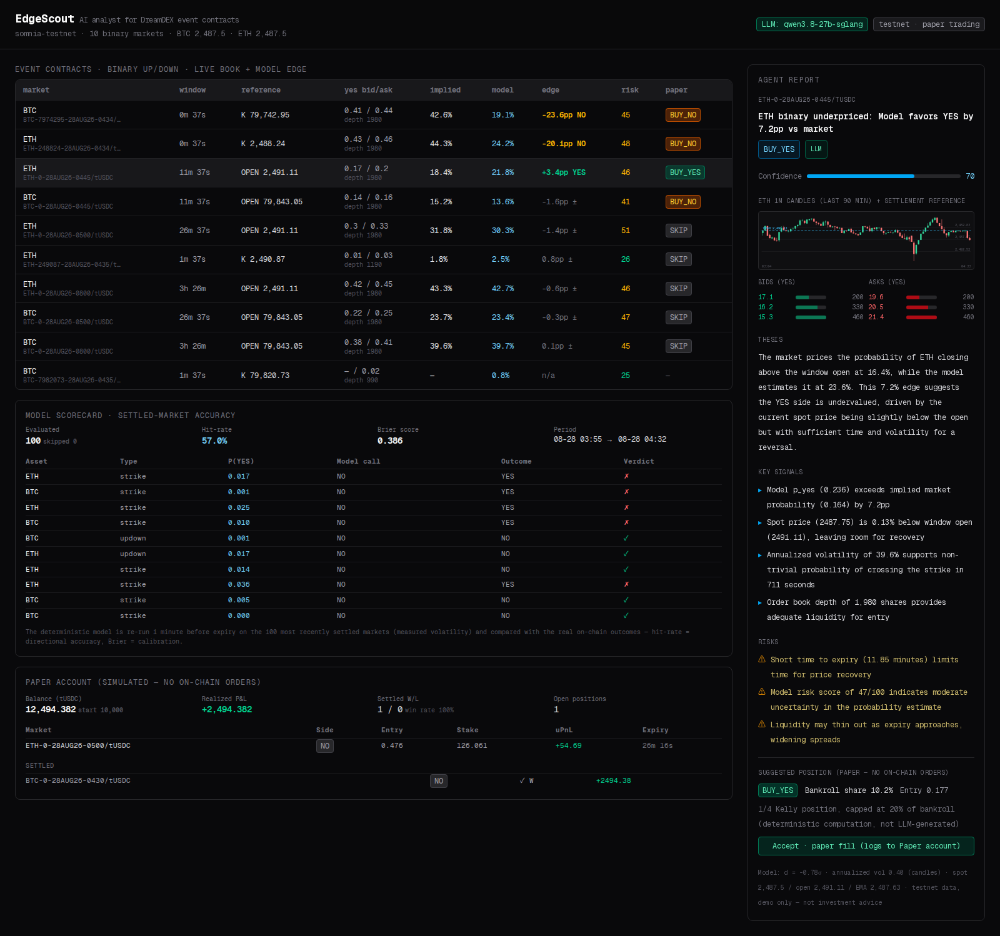
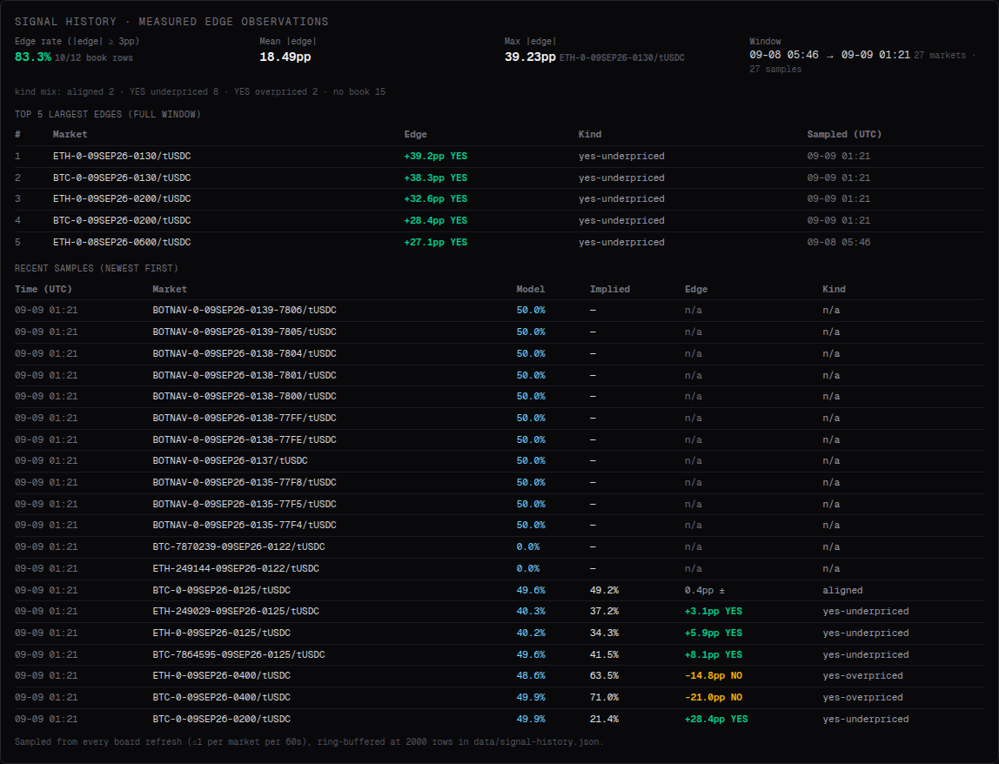

# EdgeScout — AI Event-Contract Analytics Agent

> DreamDEX Event Contracts Hackathon (Somnia Testnet)
> · BUIDL CTC 2026 Fall — BUIDL For The Real World (Creditcoin / Attestcoin, AI track)
>
> An AI analytics agent for DreamDEX binary event contracts: live Somnia-testnet
> order books → deterministic fair value (zero-drift Brownian model with
> measured volatility) → edge vs implied probability → hallucination-free LLM
> analyst report + 1/4-Kelly paper positions, all in a live dashboard.
> Since the BUIDL CTC reskin, EdgeScout also runs the **Attestcoin Protocol** as a
> verified on-chain data channel on Creditcoin CC3 testnet (see
> [Attestcoin Protocol integration](#attestcoin-protocol-integration)).

## Overview

**The problem.** DreamDEX event contracts are binary bets on where BTC/ETH price
sits relative to a reference (a strike, or the window *open* price) at expiry.
The order book is the market's probability; a stochastic model is the
mathematical probability. Their difference is an executable edge — if the book
is thin, mispriced, or slow. EdgeScout treats this as a **statistical-arbitrage
problem**: the book's implied probability is the market's view, the model's
fair value is the mathematical view, and the gap between them is the
tradeable edge.

```
 ┌────────────┐   ┌─────────────────┐   ┌──────────────┐   ┌─────────────────┐
 │  Order book │ → │  Deterministic  │ → │  Edge call   │ → │  LLM report     │
 │  + price    │   │  p_model vs     │   │  ±3pp thresh │   │  (narrates the  │
 │  live pull  │   │  p_implied      │   │              │   │  numbers only)  │
 └────────────┘   └─────────────────┘   └──────────────┘   └─────────────────┘
```

## What EdgeScout does

- **Live market wall** — all active BTC/ETH Up/Down and Strike markets on the
  Somnia testnet via the official `@somnia-chain/markets-sdk`: bid/ask,
  implied probability, model fair value, edge, risk score, suggested action.
  Auto-refreshes every 15s; no venue filtering (testnet venue activity
  churns — which venue is rolling changes; venue ids themselves are stable).
- **Click → full analyst report in seconds** — deterministic model
  `P(S_T ≥ K) = Φ(ln(S/ref)/(σ√τ))` under zero-drift Brownian motion, with
  volatility measured from 60 one-minute candles; Up/Down markets settle vs
  the window open price (fetched at the exact `tradingStart` candle, EMA
  fallback).
- **The LLM never produces a number.** Every price, probability, edge, and
  position size is pre-computed by deterministic, unit-tested code (107
  passing tests); the LLM only narrates, with an automatic deterministic
  mock fallback so the demo never breaks on stage. Confidence and position
  sizing are always re-derived from the deterministic inputs.
- **Paper trading** — 1/4 Kelly sizing (20% bankroll cap), mark-to-market,
  automatic settlement at expiry by spot-vs-reference (the testnet indexer
  never settles on-chain), persisted ledger with win-rate and P&L. No
  on-chain orders, no wallet needed.
- **Model scorecard** — re-evaluates the exact deterministic model one minute
  before expiry over the 100 most recently settled testnet markets (bounded
  concurrency, 60s server cache) and reports hit-rate + Brier score against
  the real on-chain outcomes: the model's predictive power, *measured, not
  claimed*.
- **Signal history** — every board refresh is sampled (≤1 sample per market
   per minute, 2000-row ring buffer in `data/signal-history.json`) and
   `GET /api/signals` reports how often a tradeable edge (|edge| ≥ 3pp)
   appears, how large it is, and in which direction (edge rate, mean/max
   |edge|, top-5 largest edges across the retained window, kind mix, most
   recent 20 samples); the dashboard renders a "Signal history" section
   under the scorecard. Pure deterministic aggregation, recorded
   fire-and-forget so it can never block or break the live wall; on a
   read-only filesystem it degrades to in-memory, like the paper ledger.
- **Detail view** — 90-candle SVG K-line chart with the settlement reference
  line and a top-5 bid/ask depth ladder: the model's raw inputs, verifiable
  by eye (`/api/chart?symbol=`).
- **Attestcoin Protocol attestation panel** (BUIDL CTC) — `GET /api/attest`
  pulls a Merkle + continuity proof for a Sepolia source transaction from the
  official proof-builder API and cryptographically verifies inclusion in an
  attested block via a free `eth_call` to the Block Prover precompile
  (`0x0FD2`) on Creditcoin CC3 testnet (chainId `102031`). No wallet, no
  signer, no gas; full write-up in [docs/ASC-INTEGRATION.md](docs/ASC-INTEGRATION.md).

## Screenshots

**Live market wall** — every active BTC/ETH binary market with bid/ask,
implied probability, model fair value, edge, risk and suggested action:



**One-click analyst report** — deterministic model fair value, edge, top-5
depth ladder, 90-candle K-line with the settlement reference line, LLM
thesis / signals / risks, and a one-click simulated fill:



**Signal history** — measured edge observations sampled from every board
refresh: edge rate, top-5 largest edges, and the most recent samples
(rendered under the Model Scorecard):



## Architecture & data flow

1. **`fetchBoard()`** (`src/lib/market.ts`) — `loadMarkets()` → parse the
   symbol (`BTC-<strikeRaw>-<DDMMMYY-HHMM>`; `strikeRaw × 100` = human price,
   `0` = up/down) → keep only active, unexpired markets →
   `fetchOrderBook(symbol, 5)` for top-5 two-sided bid/ask and depth → sort
   by |edge| and take `BOARD_SIZE` (default 24), with a 10s server cache.
   Up/Down markets additionally fetch the 1m-candle open at `tradingStart`
   as the settlement reference.
2. **`modelYesProbability()`** (`src/lib/model.ts`) — reference = the strike
   (strike markets) or the window open price (up/down, EMA fallback);
   `d = ln(S/ref)/(σ√τ)` → `Φ(d)` (Abramowitz & Stegun 7.1.26 normal CDF).
3. **Edge & sizing** — `edge = p_model − p_implied`; a direction is given
   only when |edge| ≥ 3pp, with the entry price taken from the matching side's
   best quote; `f* = (p−c)/(c(1−c))`, take 1/4 Kelly, capped at 20% of
   bankroll.
4. **`/api/analyze?symbol=`** — runs the full pipeline (view + report) for a
   single market; works for any live market, not just ones on the board
   (validated against the indexer first).
5. **`/api/chart?symbol=`** — the last 90 1m candles + settlement reference
   (the detail-view data plane).
6. **`/api/paper` / `/api/paper/open`** — read the paper account / open a
   simulated position (POST `{symbol}`, filled at 1/4 Kelly at the current
   suggestion).

## Tech stack

| Layer | Choice | Notes |
|---|---|---|
| Frontend / full-stack | Next.js 16 (App Router) + React 19 + Tailwind | Single repo, dark terminal-style dashboard |
| Data source | `@somnia-chain/markets-sdk@0.28.1` | Official SDK, indexer GraphQL + RPC, read-only (no wallet) |
| Model | TypeScript (zero third-party deps) | A&S 7.1.26 normal CDF, volatility from 1m candles |
| LLM | Any OpenAI-compatible endpoint (`.env`) | Auto mock fallback when absent |

## Run

```bash
npm install
cp .env.example .env   # optional: LLM_API_KEY + CC3 testnet attest vars (all have live defaults)
npm test               # 92 deterministic tests, zero framework
npm run build && npm start
# → http://localhost:3000
```

Works with no LLM key and no testnet wallet (read-only + simulated). Real
order placement would require `@dreamdex-bot-kit/ec-core` (out of scope for
this demo).

## Directory

```
src/lib/config.ts   # config (testnet endpoints, caches, Kelly params, LLM)
src/lib/model.ts    # deterministic probability / edge / risk / sizing (+ model.test.ts)
src/lib/market.ts   # market parsing + book + candles + board building + chart data
src/lib/llm.ts      # report generation (LLM + mock fallback)
src/lib/agent.ts    # analysis pipeline orchestration
src/lib/paper.ts    # paper-trading ledger (simulated fill / mark-to-market / auto-settle, file persistence)
src/lib/signals.ts  # signal/edge observation log (60s/market sampling, 2000-row ring buffer, pure summary core)
src/lib/attest.ts   # Attestcoin Protocol read-only attestation (prover API + 0x0FD2 eth_call)
src/components/     # CandleChart (SVG K-line + settlement reference line) + AttestPanel + KeeperPanel + SignalHistoryPanel
src/app/            # Next.js dashboard + /api/markets /api/analyze /api/chart
                    #             + /api/health /api/paper /api/paper/open /api/scorecard /api/signals /api/attest /api/asc
contracts/        # EdgeScoutSignalStore ASC (Foundry, 29 tests); deploy scripts in scripts/
```

## Deterministic unit tests

`npm test` runs 112 cases (Node built-in `node:test`, zero framework):
17 model cases (CDF, reference priority, expiry settlement semantics, Kelly
formula & 20% cap) + 14 paper-ledger settlement cases (binary payout,
dual-side mirroring, expiry gate, stale entries, spot cache, no-op does not
write; hermetic temp cwd, zero network) + 9 scorecard cases (hit-rate / Brier
aggregation, 0.5 boundary direction, ×100 strike-conversion self-healing)
+ 22 Attestcoin Protocol cases (hash/name/proof parsing, pipeline failure paths,
precompile caching) + 10 ASC reader cases (all offline, injected transports)
+ 20 KeeperHub execution-layer cases (fully offline fake transport: config, sizing,
MCP/REST paths, 409 replay guard, ledger write-back)
+ 20 signal-history cases (sampling gate, ring-buffer cap, lastAtMs persistence/pruning,
malformed- and wrong-version-file recovery, pure summary aggregation incl. top-5 largest-edge selection).

## Attestcoin Protocol integration

EdgeScout uses the [Attestcoin Protocol](https://docs.attestcoin.org) as a
verified cross-chain data channel on **Creditcoin CC3 testnet** (chainId
`102031`). For BUIDL CTC 2026 Fall (AI track) it demonstrates the full
readability pipeline, strictly read-only:

1. `GET {prover}/api/v1/attested-height/1` — highest attested Sepolia block.
2. `GET {prover}/api/v1/proof-by-tx/1/{txHash}` — Merkle + continuity proof.
3. `eth_call` to the Block Prover precompile `0x0FD2` (`verify`) → boolean.

The dashboard panel shows the result as a **VERIFIED ON-CHAIN** badge with the
source chain, proven block, Merkle root and attested height. Default example:

```bash
curl http://localhost:3111/api/attest
# → {"ok":true,"verified":true,"sourceChain":{"name":"Ethereum Sepolia",...}}
```

### On-chain ASC — `EdgeScoutSignalStore`

EdgeScout also ships its **own ASC (Attestcoin Smart Contract)** in
`contracts/`: it re-verifies a proof through `0x0FD2` *inside* the transaction,
then stores the decoded fact on-chain (replay-protected, receipt-status checked).
`forge test` covers it with 29 offline tests; `GET /api/asc` reads its state with
`eth_call` only. Deploy with `node scripts/deploy-asc.mjs` and record a fact with
`node scripts/attest-on-asc.mjs` — both await tCTC from the Creditcoin Discord
faucet, so the panel currently reads *"not deployed yet"*.

Full technical write-up, trust model, reproduction guide and evidence:
[docs/ASC-INTEGRATION.md](docs/ASC-INTEGRATION.md).

## KeeperHub execution layer (Agent Economy)

For the DoraHacks "KeeperHub - The Agent Economy" entry, EdgeScout acts as
the signal generator and [KeeperHub](https://app.keeperhub.com) as the
execution layer: when the deterministic 1/4-Kelly model sizes a paper
position, KeeperHub moves matching testnet USDC on **Base Sepolia** from the
org wallet, and the transaction link is written back into the paper ledger
entry (`entry.keeperhub`).

- `GET /api/keeperhub` — status (60s cache): configured?, chain, USDC token,
  stake cap, dry-run flag, org wallet, last five executions. Without an API
  key it answers `{"ok":true,"configured":false, note}` — an honest degraded
  state, never a hard error.
- `POST /api/keeperhub { symbol, mode?: "simulate" | "execute" }` — mirrors an
  OPEN paper position with a KeeperHub transfer. Amount = the position stake,
  capped by `KEEPERHUB_MAX_STAKE_USD`. Idempotency keys are derived from the entry id
  and mode (`edgescout-<entryId>-<mode>`), so a second execution of the same position
  is rejected with HTTP 409 instead of re-sent.
- Execution surfaces: the transfer is sent through KeeperHub's documented
  MCP `execute_transfer` surface, with an automatic fallback to the
  documented REST `POST /api/execute/transfer` (same idempotency key on
  both, so a fallback after a partially-completed MCP call dedupes instead
  of double-spending). A simulation preflight must report success and no
  revert before anything broadcasts.
- Dashboard: a KeeperHub status panel plus an "execute on-chain via
  KeeperHub" button on every open position; successful runs show the tx
  link (Base Sepolia explorer) in the On-chain column.

Configuration: `KEEPERHUB_API_KEY` (org key, `kh_...`) in `.env` — see
`.env.example`. Unit tests in `src/lib/keeperhub.test.ts` run fully offline
through an injectable transport.

### Unattended trigger

`node scripts/signal-trigger.mjs [--dry-run] [--all]` scans open paper
positions and fires the same `POST /api/keeperhub` path for every position
that has not been executed yet — the webhook-shaped automation counterpart of
the dashboard button (cron or any caller can invoke it). `KEEPERHUB_DRY_RUN=true`
in `.env` forces simulate mode; already-executed entries are skipped and the
server-side idempotency key prevents double-spend on retry.

### Live-execution tooling

- `node scripts/check-wallet-funding.mjs` — read-only funding pre-check:
  resolves the org wallet from the live API and queries Base Sepolia RPC for
  native ETH and USDC balances (exits non-zero when under 5 testnet USDC).
- `node scripts/keeperhub-smoke.mjs` — the smoke steps on their own; writes
  `.attestcoin/keeperhub-evidence.json`.
- An offline KeeperHub test double is included (`node scripts/mock-keeperhub.mjs`,
  port 9999), so the whole pipeline can be exercised without a funded org
  wallet.

## Known limitations

- Testnet books are thin and noisy; an "edge" may be a counterparty's
  mispricing rather than a real opportunity (the model itself does not
  generate alpha).
- 1m-candle volatility is a coarse approximation for short windows (≤5min).
- Pure simulation: no fees/slippage; real trading needs `ec-core` integer
  price conversion (venue 18 decimals).
- The paper ledger persists to `data/paper-ledger.json`; on a read-only
  filesystem (e.g. Vercel serverless) it degrades to an in-memory ledger
  (valid for the instance lifetime); local/self-hosted keeps it across
  restarts.
- The signal log (`data/signal-history.json`) is a local ring buffer (2000
  rows, one sample per market per minute); on a read-only filesystem it
  degrades to in-memory, same as the paper ledger.
- `POST /api/keeperhub` is unauthenticated (testnet demo only): the amount
  is capped by `KEEPERHUB_MAX_STAKE_USD`, re-executing an executed position
  is rejected with 409, and destination addresses are validated — but do
  not expose the port on a public network while a funded org key is set.

---
*testnet data is for demonstration only and is not investment advice.*
